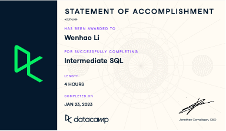
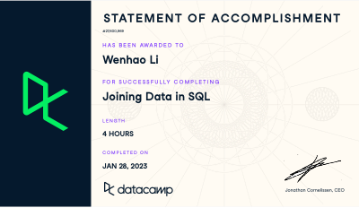
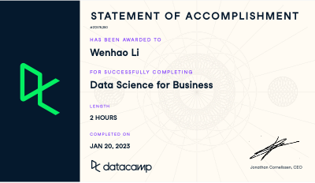

# Wenhao-CIDM6395-Capstone

Assessing Data Analytics

What Do I Know (Strengths):
Data Analysis Techniques:
I am proficient in statistical analysis and data visualization, enabling me to extract meaningful insights from data. I have a strong grasp of data analysis techniques and have applied them in various projects.

Tool Proficiency:
I am skilled in using a range of data analytics tools, including Python, R, and data analytics platforms. These tools have been instrumental in my data analysis work and have allowed me to approach complex data challenges effectively.

Statistical Knowledge:
I have demonstrated capabilities in performing hypothesis testing, regression analysis, and clustering. These statistical techniques are among my strengths, and I have utilized them successfully in different projects.

Where Am I Weak (Weaknesses):
Big Data Analytics:
One area where I recognize a gap in my knowledge is big data analytics. While I have a solid foundation in traditional data analytics, I have limited experience in handling and analyzing large-scale datasets, which is becoming increasingly important in today's data-driven world.

Advanced Machine Learning:
I acknowledge the need to improve my understanding of advanced machine learning algorithms. Areas such as deep learning and reinforcement learning are essential for solving complex problems, and I'm eager to enhance my skills in these domains.

Domain-Specific Knowledge:
To become a more well-rounded data analyst, I could work on enhancing my domain-specific knowledge. Gaining expertise in specific industries or sectors will allow me to provide more tailored solutions in real-world data analytics scenarios.

What Do I Wish I Knew:
Deep Learning Techniques:
I wish I had a deeper understanding of deep learning techniques, including neural networks and natural language processing. These advanced methods are crucial in areas like image recognition, natural language understanding, and more.

Real-Time Data Analytics:
Exploring real-time data analytics further is an area of interest. Understanding how to process and analyze data in real-time settings can be valuable in various applications, from finance to IoT.

Industry-Specific Challenges:
More hands-on experience with industry-specific data analytics challenges is something I desire. This would involve delving into the unique data-related issues faced by specific sectors, such as healthcare, finance, or e-commerce.

Support:
Samples of work:
https://github.com/wli1992/The-Pandas-Workshop; 

Source of knowledge:
VS code, Github, Textbook: The Pandas Workshop: A comprehensive guide to using Python for data analysis with real-world case studies. Excel, SQL Tutorial, Tableau, RapidMiner, Datacamp, Textbook: Data Science for Business.

Summary Statement:
In summary, my competencies in Data Analytics encompass statistical analysis, data visualization, tool proficiency, and statistical knowledge. I have successfully applied these skills in both academic and practical projects. I am enthusiastic about addressing my identified weaknesses and exploring areas I wish to know more about.

Assessing Data Management

What I Know (Strengths):

Data Modeling: I have a strong understanding of data modeling techniques and have worked with various tools to design efficient and structured databases. I can create Entity-Relationship Diagrams (ERDs) and understand the importance of normalization in database design.

SQL: I am proficient in SQL (Structured Query Language) and can write complex queries to retrieve, manipulate, and manage data in relational databases. I'm confident in using SQL for data retrieval and data modification tasks.

Database Management Systems: I have hands-on experience with different Database Management Systems (DBMS) like MySQL, PostgreSQL, and SQLite. I can set up and manage databases, as well as optimize their performance.

Data Warehousing: I have a basic understanding of data warehousing concepts, including ETL (Extract, Transform, and Load) processes, data warehouses, and data marts.

Data Quality: I understand the importance of data quality and have used data profiling and cleansing techniques to ensure data accuracy.

Where I'm Weak (Weaknesses):

NoSQL Databases: I have limited experience with NoSQL databases like MongoDB, Cassandra, or Redis. I need to strengthen my knowledge in this area, as NoSQL databases are becoming increasingly popular for handling unstructured data.

Big Data Technologies: I lack expertise in big data technologies like Hadoop, Spark, and distributed data processing. In the era of big data, it's crucial to have skills in handling large datasets and leveraging these technologies for data analysis.

Advanced Data Analytics: While I have a solid foundation in data analytics, I'm less proficient in advanced data analysis techniques, machine learning, and predictive modeling. I wish to enhance my skills in these areas to work on more complex analytics projects.

Data Security: My knowledge of data security and privacy is basic. I need to delve deeper into data encryption, access control, and compliance with data protection regulations.

What I Wish I Knew:

Advanced Machine Learning: I wish I had a deeper understanding of advanced machine learning algorithms, neural networks, and deep learning. These are powerful tools for predictive analytics and AI applications.

Data Governance: I'd like to explore data governance practices and strategies to ensure data quality, compliance, and responsible data management within organizations.

Real-time Data Processing: More hands-on experience with real-time data processing and stream processing frameworks like Apache Kafka would be valuable in today's fast-paced data environments.

Data Ethics and Privacy: In an era of increasing data privacy concerns, I wish to have a comprehensive grasp of data ethics and privacy regulations like GDPR.

Source of knowledge: Python, Google Colab, exercises from textbook: Data management: Databases and Organizations, Datacamp

Summary Statement:

In summary, I have a strong foundation in Data Management, including data modeling, SQL, and database management. However, I recognize the need to strengthen my knowledge in areas such as NoSQL databases, big data technologies, advanced data analytics, and data security. I'm eager to continue learning and integrating these skills into my portfolio and capstone project, where effective Data Management will be essential for success.

Support: Samples of work
   

Assessing Software Systems

What Do You Know

In my Software and Systems coursework, I've gained competencies in various areas:
•	Proficient in programming languages like Python, HTML, CSS with the ability to develop software applications and scripts.
•	Skilled in system architecture design and implementation, demonstrated in a group project where I designed the architecture for a web-based application.
•	Proficiency in database management, including SQL and NoSQL databases, with an example of a database project where I optimized query performance.
•	Experience in version control systems like Git, evident from my active contribution to a team project on GitHub.

Where Are You Weak

While I am confident in the areas mentioned above, I acknowledge some weaknesses:
•	Limited exposure to real-time systems and embedded programming.
•	Need to enhance my knowledge of cybersecurity practices and secure coding principles.
•	Need to have knowledge of software development methodologies, including Agile and Scrum.

What Do You Wish You Knew

I wish to have a deeper understanding of DevOps practices and tools, as I recognize the importance of continuous integration and continuous deployment (CI/CD) in modern software development. Additionally, I believe I may be missing insights into microservices architecture and containerization technologies like Docker and Kubernetes.

Samples of Work

https://github.com/wtamucis/assignment-python-chapter-3-wli1992
https://github.com/wtamucis/assignment-python-chapter-4-wli1992
https://github.com/wtamucis/assignment-python-chapter-5-wli1992
https://github.com/wtamucis/assignment-python-chapter-6-wli1992
https://github.com/wtamucis/assignment-python-chapter-7-wli1992
https://github.com/wtamucis/assignment-python-chapter-8-wli1992
https://github.com/wtamucis/assignment-python-chapter-9-wli1992
https://github.com/wtamucis/assignment-python-chapter-10-wli1992
https://github.com/wtamucis/assignment-python-chapter-11-wli1992

Sources of knowledge
Mosh's Python Mastery ebook, Datacamp.com, VS code, HTML tutorial, Github.com

Summary Statement

In summary, I am confident in my software development and system architecture skills. However, I acknowledge the need to improve my knowledge in cybersecurity, DevOps, and cloud computing. I am well-prepared to apply my current skills to the Capstone project and beyond.

Contribution Towards the Capstone

The knowledge and skills I've acquired in Software and Systems are integratable with the other areas in the Capstone project. For example, my strong programming skills can contribute to data analysis tasks, and my system architecture experience is valuable for designing robust data management solutions. I look forward to bringing these competencies to the Capstone to create a comprehensive and effective solution.

Assessing Networking and Cybersecurity

What do you know:

I have acquired several competencies and skills in the Networking and Cybersecurity domain:

Risk Assessment and Management:
I have developed a strong understanding of personal risk assessment and management. This includes the ability to perform tasks such as asset inventory and risk assessment. These skills are fundamental in the field of cybersecurity.

Recovery Planning:
I have gained knowledge and skills related to recovery planning, encompassing components such as audit plans, contingency plans, security audit reports, and security management. These elements are crucial for ensuring business continuity in the event of a security incident.

Network Security Tools:
I am proficient in using various network security tools, including NMAP, Wireshark, Shields Up, and Nessus. These tools are indispensable for discovering network vulnerabilities and protecting networks from potential threats.

Ransomware Recovery:
I have also delved into the realm of ransomware recovery, which is a critical skill in mitigating one of the most prevalent and damaging cybersecurity threats. 

Where are you weak:

It's important to note that the level of detail in my description is somewhat brief. To enhance my competencies, I should provide more specific examples or experiences that demonstrate the depth of my knowledge and skills in these domains.

What do you wish you knew and/or don't realize you are missing:

I wish to gain more insights into the specific techniques and methodologies used for risk assessment, recovery planning, and the application of security tools.
Acquiring relevant certifications and practical experiences in the field would be beneficial in strengthening my competencies.

Integration with Other Domains:

In software development, understanding cybersecurity is crucial for building secure applications. Knowledge of security tools aids in identifying and mitigating vulnerabilities in software. In the context of data science, cybersecurity expertise ensures data remains confidential and is protected against cyber threats. In Data Analytics, security is vital to protect sensitive data from breaches. Understanding cybersecurity is integral to ensuring data integrity and privacy. In Network Management, the principles of network security are essential for maintaining the integrity and availability of network services.

Summary Statement:

My competencies in Networking and Cybersecurity are well-rounded, with strengths in network security, threat assessment, security best practices, and incident response. I acknowledge areas for improvement and am committed to addressing them. I am prepared to seek advanced certifications, deepen my understanding of legal and ethical aspects, and enhance my penetration testing skills.

My capabilities and competencies in Networking and Cybersecurity position me to excel in future settings, particularly in roles related to network security and cybersecurity management.

These competencies significantly contribute to my portfolio and prototype representative project for the capstone. My capstone project aims to address a real-world cybersecurity challenge, and the skills I have acquired in this domain will be pivotal in its successful execution.

Contribution Towards the Capstone:

The integration of Networking and Cybersecurity into the capstone project adds a robust layer of security and risk management. Ensuring the security of the capstone project's infrastructure and data is a top priority. My expertise will be instrumental in identifying and mitigating potential security threats.

Moreover, I envision creating a capstone project that showcases how Networking and Cybersecurity integrate with Data Analytics, Software Development, and Network Management, demonstrating their essential role in safeguarding digital assets. This holistic approach aligns with the overarching objective of the capstone project, providing a comprehensive solution that reflects the synergy of these domains.

By successfully integrating Networking and Cybersecurity with other domains, I will contribute to the capstone's success and make a unique statement about the importance of comprehensive security measures in contemporary IT projects.

Simples of work:

What did you do?
I managed six assets of people, procedures, data, software, hardware, networking for asset inventory and Risk Assessment. According to the Asset Inventory and Risk Assessment Table Template, Dr. Jennex required to do the first 4 columns, which are ID, Asset Name, Description, system ID. For people, I managed 12 assets. I put them into System ID 1. For procedures, I managed 18 assets. I put them into System ID 2. For data, I managed 17 assets. I put them into System ID 3. For software, I managed 15 assets. I put them into System ID 4. For hardware, I managed 18 assets. I put them into System ID 5. For networking, I only managed 9 assets. I put them into System ID 6. Totally are 89 assets. During the inventory process, I grouped assets by their function and location within the organization. For example, all servers were grouped together regardless of their operating system or application, and all network devices were grouped together. Within each group, I further divided assets by their location, such as physical location or network segment. When dealing with assets that could be in multiple groups, I decided based on the asset's primary function or location. For example, a printer connected to a specific department's network was categorized as a department asset, even though it could also be considered a network asset. In cases where an asset was truly ambiguous or could not be easily categorized, I created a separate category for those assets and documented them accordingly. 

What were the results?
The inventory of assets can help identify the potential attack surface of a system. Attack surface refers to the ways in which an attacker can exploit vulnerabilities in a system to compromise its security. By conducting an inventory of assets, we can identify the various entry points an attacker can use to gain access to the system and its data. For example, if the inventory includes a list of servers, applications, and databases, an attacker can target these assets to exploit any vulnerabilities in their security. Similarly, if the inventory includes a list of users and their access privileges, an attacker can target specific users to gain unauthorized access to the system. The inventory can also help identify any gaps or weaknesses in the system's security controls. For example, if the inventory shows that certain assets are not protected by firewalls or have outdated software versions, these assets can be considered vulnerable and should be prioritized for remediation. Overall, the inventory can provide valuable insights into the potential attack surface of a system and help organizations prioritize their security efforts to mitigate the risks.

What did you learn?
The results of an inventory and assessment can vary depending on the scope and depth of the analysis. It is possible that the attack surface is larger than expected, indicating that there are more vulnerabilities and risks present in the system. Alternatively, it is possible that the attack surface is smaller than expected, indicating that the system is more secure than anticipated.
It is essential to remember that risk is not solely determined by the size of the attack surface. Other factors, such as the nature of the assets, the value of the data, the level of access controls, and the strength of security measures, also play a significant role in determining the overall risk level. Therefore, it is crucial to consider all these factors in determining the level of risk present in the system.

1.	I was conducting an inventory and risk assessment of various assets. The first asset I assessed was my father, who is a close family member and deemed vital to my personal and emotional well-being. To conduct the assessment, I first conducted an inventory of all the personal information related to my father, including his full name, date of birth, social security number, and medical records. I then categorized the asset as "Person or my close family member" and assigned a CIA asset value of $2 million due to the high value placed on his confidentiality. Next, I identified the threats and vulnerabilities associated with this asset. The main threats were modifications to his personal information, such as identity theft, being drunk and sharing sensitive information, and memory loss leading to accidental disclosure. The vulnerability was identified as being low due to the low probability of these events occurring. To mitigate these risks, controls were put in place, such as having conversations with him to ensure he understands the importance of keeping his personal information secure and controlling his alcohol consumption to avoid unintentional disclosure. The ARO for these threats was determined to be low at 0.05. Considering the controls in place and the uncertainty of the threats occurring, the overall risk value was calculated to be $22,000. This value indicates that while the risks are low, they still require attention and mitigation. To further mitigate the risks, the action plan ID involves having conversations with my father and working on his emotional wellbeing to avoid memory loss and accidental disclosure. Overall, our risk posture is relatively low, but the asset still requires ongoing monitoring and mitigation to maintain its confidentiality and security. 

2.	As part of our company's (Wells Fargo N.A.) risk management process, we conducted an inventory and risk assessment of our assets. We identified all assets, including procedures and processes, and categorized them based on their value and priority. We also identified potential threats and vulnerabilities that could impact their confidentiality, integrity, and availability. One of the critical assets we assessed was our backup and recovery procedure, with a system ID of 2 and a CIA asset value of $1 million. The priority of this asset was deemed vital, as any failure or inadequacy in backup and recovery procedures could result in data loss, extended system downtime, and inability to resume normal operations. We assessed the potential threats and vulnerabilities that could impact this asset and found that inadequate backup and recovery procedures or failure to test them regularly could result in significant risks to the company's operations. We determined that the likelihood of such an event occurring was low, with an ARO of 0.05. Currently, we have controls in place, including regular performance and testing of backup and recovery procedures and secure storage of backup data. However, there is still some uncertainty regarding the efficacy of our controls, with an uncertainty rating of 0.5. Based on these factors, we calculated the risk value of this asset to be $22,500. To reduce this risk, we plan to implement additional testing and verification of backup and recovery procedures, periodic review and updating of procedures to ensure they align with current system configurations and data volumes. Overall, our risk posture is moderate, with several assets identified as high-priority and in need of further assessment and risk reduction measures.

3.	As part of our organization's risk assessment process, we conducted an inventory of our assets and evaluated the potential risks associated with each. We categorized our assets based on their type, value, and importance to our business operations. One of the assets we evaluated was the Bluetooth software on our laptops, which is used for wireless communication. The system ID for the Bluetooth software is 3, with a CIA asset value of $1000 and a priority rating of medium due to its importance for confidentiality, integrity, and availability. We identified potential threats to this asset, including unauthorized access, interception, and eavesdropping. Hackers could intercept data transmitted over Bluetooth and use it maliciously, posing a significant risk to our business operations. To mitigate these risks, we have put in place controls such as password-protected pairing, disabling discoverability, encryption of data transmitted over Bluetooth, and periodic updates of Bluetooth software and firmware. These controls have an ARO (annual rate of occurrence) of 0.1 and a certainty level of 0.8. Despite these measures, there is still some uncertainty about the effectiveness of our controls, which we have rated at 0.1. Our risk value for this asset is $50.00, which is relatively low. However, we recognize that we could further reduce this risk by avoiding the use of Bluetooth in public places or implementing two-factor authentication for Bluetooth pairing. Our action plan ID is to review our current controls periodically and consider implementing additional measures if necessary. In summary, our overall risk posture is relatively low, but we are constantly evaluating and improving our controls to ensure the security of our assets. Our asset inventory/risk assessment matrix and system/risk assessment matrix provide a visual representation of our assets and the potential risks associated with them, which helps us prioritize our efforts to mitigate those risks.

4.	I was a proud owner of a new Apple MacBook in 2020. I used it every day for work, entertainment, and personal tasks. However, I was also aware of the potential risks and vulnerabilities that could compromise the security and availability of my laptop. To conduct an inventory and risk assessment, first listed all my digital and physical assets, including the MacBook. I then categorized the assets based on their type, value, and purpose. Next, I identified the potential threats and vulnerabilities that could affect the MacBook, such as physical theft, unauthorized access, malware and other cyber-attacks, hardware failure, and environmental hazards. I also assessed the likelihood and impact of each threat and vulnerability. Based on my assessment, I prioritized the MacBook as a high-value asset due to its importance for work and personal life. I also valued it at $2500 based on its market price and the value of the data stored on it. To mitigate the risks, I implemented several controls, such as password protection, firewall, encryption, backup and recovery, and physical security measures. I also assessed the uncertainty of these controls and calculated the risk value of the MacBook, which was determined to be moderate. Based on the risk assessment, I identified the need for additional controls, such as regular software and firmware updates, and periodic reviews and updates of the security measures. I estimated the cost of these controls to be $375.00. Overall, I concluded that his risk posture was relatively low, but I recognized the importance of maintaining and updating the controls to prevent any potential security incidents. 

5.	I had purchased a brand-new Volkswagen SUV in 2018 and was excited to take it out for a spin. But before I did, I knew I needed to assess the risks associated with owning assets. First, I conducted an inventory of all my assets and categorized them based on their purpose. My Volkswagen SUV fell under the category of transportation systems. The vehicle was categorized as a high-value asset, with a CIA (Confidentiality, Integrity, Availability) asset value of $10 million. In identifying potential threats and vulnerabilities to my vehicle, I recognized that it is vulnerable to physical theft, compromise of software, and accidents. In the event of any of these incidents, the confidentiality, integrity, and availability of the vehicle could be compromised, leading to significant financial loss. To mitigate these risks, I have basic security measures in place, such as locking the doors and keeping the vehicle in a secure location when not in use. However, there is still some uncertainty around the effectiveness of these measures, and the likelihood of a threat occurring is rated as medium (.1 ARO). Based on my risk assessment, I determined that there is a significant risk associated with my Volkswagen SUV, with a risk value of $500,000. To reduce this risk, I need to implement additional controls, such as tracking devices and remote access controls, and invest in regular maintenance to ensure the vehicle's software is up-to-date and secure. In conclusion, this risk assessment highlights the need for continuous monitoring and control of assets to mitigate risks associated with them. By identifying vulnerabilities and implementing appropriate controls, we can reduce the likelihood of security incidents and protect our valuable assets.

6.	It was a typical afternoon in 2016 when I received a call from the Social Security Administration in Birmingham, Alabama. My heart started racing as I answered the phone, wondering what could be wrong. The representative on the other end of the line informed me that my social security number had been compromised. Someone in California had hacked into my personal information and had attempted to use my social security number to gain employment. My Social Security card was the main asset that was compromised in this incident. It holds a high CIA (Confidentiality, Integrity, Availability) asset value of $100,000, as it contains sensitive personal information that is critical to your financial and reputational well-being. I was shocked and scared. I had always taken great care to protect my social security number, and I couldn't believe that someone had been able to get their hands on it. The representative assured me that they had caught the fraudulent activity and had taken steps to prevent any further misuse of my information. They also provided me with resources and steps to take to protect myself and my identity moving forward. As I hung up the phone, I realized how fortunate I was that the Social Security Administration had caught the fraudulent activity. The potential consequences of having my identity stolen could have been devastating. I immediately went to my desk and pulled out my risk assessment matrix that I had created for my personal assets. My social security card was classified as a high-value asset with a very high-risk value. Given the high value of my social security number and the prevalence of identity theft, I assessed the ARO as "Very High" at 0.2. The confidentiality and integrity of my personal information were at risk, which could lead to financial loss and reputational harm. I had always known that my social security card was an essential asset that required strict controls to prevent unauthorized access. I kept the card in a secure place and never carried it in my wallet. However, I had uncertainty around the effectiveness of these controls, which led to a risk value of $8,000. This incident made me realize that I needed to be even more vigilant in protecting my personal information. I reviewed my asset inventory/risk assessment matrix and my system/risk assessment matrix and identified areas where I needed to improve my controls. I also created an action plan to strengthen my controls and reduce my overall risk posture. In conclusion, this incident taught me the importance of conducting regular risk assessments and maintaining strong controls over high-value assets such as social security cards. With the increasing prevalence of identity theft and cyber-attacks, it's critical to take proactive measures to protect personal information and prevent unauthorized access.

7.	My macOS is a critical asset in my inventory, which is used to store sensitive and confidential information. To ensure its security, I assessed its potential risks and vulnerabilities. The inventory was conducted by listing all the critical assets that are essential to your business operations. I categorized your assets by their level of importance, assigning a CIA asset value based on confidentiality, integrity, and availability. I identified threats and vulnerabilities by assessing the potential risks associated with each asset. My macOS, which is used for networking and is essential for my daily business operations, was identified as a high priority asset with a CIA asset value of $500,000. External threats were identified as the primary threat category, and the vulnerability associated with the firewall was identified as a potential point of entry for attackers. To mitigate this vulnerability, controls were already in place, including blocking all incoming traffic except for authorized requests, and the likelihood of an attack was assessed as medium with an ARO of .1. Despite the controls in place, the risk value of this vulnerability was assessed as high with a risk value of $25,000.00, indicating that additional controls may be needed to further reduce risk. The overall risk posture was assessed as moderate, with some areas of concern identified that require additional controls and monitoring.

What did you do:
        To conduct the network mapping on a Mac, I followed a similar approach using NMAP. After obtaining permission from the organization, I visited the official NMAP website and downloaded version 7.94 specifically designed for macOS. I then proceeded to install and set up the software on my Mac computer.
        Once NMAP was successfully installed, I opened a Terminal window to access the command-line interface. From there, I executed the necessary commands to perform network scanning. Using a combination of scanning techniques and options provided by NMAP, I gathered information about the network infrastructure. This involved conducting host discovery scans, port scanning, and utilizing aggressive scanning options to identify potential vulnerabilities.
         To analyze the network and its attack surface, I used a combination of network scanning and enumeration techniques. I started by scanning the IP address range of the specific locations, namely the Amarillo airport (192.168.1.214), Southwest in-flight WIFI (10.188.61.38), and my friend's house in Dallas (192.168.1.49). During the scanning process, I employed various tools and techniques to discover active hosts, open ports, and services running on those hosts.
         After the scanning phase, I performed enumeration to gather more detailed information about the identified hosts and services. This involved querying the open ports to determine the specific protocols and applications running on each host. I also gathered information about the operating systems, software versions, and other relevant details to assess the potential vulnerabilities and attack vectors.

What are the results:
    During the network mapping exercise, I discovered several components and protocols within the organization's network. The components consisted of various devices such as desktop computers, laptops, servers, routers, switches, printers, and IoT devices. I also observed the presence of mobile devices like smartphones and tablets, which were connected to the network. 
    In terms of protocols, the network utilized common protocols such as TCP/IP, DHCP, DNS, HTTP, HTTPS, SSH, FTP, and SNMP. These protocols facilitated communication and data transfer across the network infrastructure.
     The network components and protocols used in the mentioned locations may vary, but they typically include a mix of wired and wireless technologies. Here's an analysis of the components and protocols that might be present: Amarillo airport (192.168.1.214): The airport is likely to have a combination of wired infrastructure, such as routers, switches, and firewalls, to manage the network traffic. Wireless access points (APs) provide connectivity for passengers. The protocols used may include TCP/IP for data transmission, DHCP for IP address allocation, DNS for domain name resolution, and HTTP/HTTPS for web browsing. Southwest flight WIFI (10.188.61.38): In-flight WIFI services on airplanes often utilize satellite-based communication to connect to the internet. Passengers may connect through onboard wireless networks, and the network protocols used are like those in other WIFI environments. My friend's house in Dallas (192.168.1.49): Residential networks typically consist of a router connected to an internet service provider (ISP). WIFI access points allow wireless connectivity within the house. Common protocols include TCP/IP, DHCP, DNS, and various application-layer protocols for online services.
     Analyzing the attack surface of the network, I considered different areas that could be vulnerable to cybersecurity attacks. This included mobile devices, which could be targeted through malicious apps or network exploits. Bluetooth connections posed risks of unauthorized access or device impersonation if not properly secured. IoT devices, if not adequately protected, could serve as entry points for attackers to gain access to the network. Wireless networks, if not encrypted or with weak security configurations, could be susceptible to unauthorized access and eavesdropping. Additionally, cloud components and protocols could introduce security challenges if not effectively managed, potentially leading to data breaches or unauthorized access.
    The attack surface of the network is the total number of potential entry points or vulnerabilities that could be exploited by a cyber attacker. In the mentioned locations, the attack surface may include the following components: WIFI networks: Unsecured or weakly secured WIFI networks are vulnerable to attacks like man-in-the-middle (MITM), rogue access points, and eavesdropping. Attackers may attempt to intercept sensitive data or inject malicious content into the network. Network devices: Routers, switches, and firewalls could be targeted for exploitation if they have known vulnerabilities or default credentials. Unauthorized access to these devices may enable attackers to manipulate network traffic or gain control over the network. Internet-connected devices: If any IoT devices are present, they may be susceptible to cyber-attacks if not properly secured. IoT devices are notorious for having weak security measures, making them attractive targets for attackers. Cloud services: If any cloud services are used in the network, misconfigurations or weak authentication measures could expose sensitive data to unauthorized access.

What did you learn:
       This assignment provided valuable insights into the intricacies of digital networks and the concept of the attack surface. I learned how to effectively use NMAP to map and analyze networks, allowing me to understand the network topology, identify devices, and assess potential security risks.
      One significant lesson learned was the importance of considering all aspects of the network when assessing the attack surface. This involved not only traditional wired components but also mobile, Bluetooth, IoT, wireless, and cloud components. Each of these areas presented unique security challenges that required careful consideration and appropriate security measures.
      Furthermore, I realized the significance of continuous monitoring and regular security assessments to ensure the network remains protected against evolving cybersecurity threats. By identifying vulnerabilities and implementing necessary security measures, organizations can enhance their overall security posture and mitigate potential risks.
     In the future, the knowledge gained from this assignment can be applied to strengthen network security practices. By identifying and addressing vulnerabilities, organizations can proactively protect their networks and sensitive data. Additionally, understanding the attack surface allows for better resource allocation and prioritization of security efforts to maximize protection.
     For the organization, the insights from this network mapping exercise can guide their cybersecurity strategy. By understanding the components, protocols, and potential vulnerabilities, they can implement appropriate security controls and measures to mitigate risks. This will help in safeguarding their network infrastructure, maintaining data confidentiality, and ensuring the integrity and availability of critical systems and information.

What did you do?

For this assignment, I obtained permission from the Canyon Public Library to conduct network analysis and packet capturing using Wireshark on their Wi-Fi network. Before starting the process, I ensured that I had the necessary authorization to monitor and analyze their network traffic.
The following steps were involved in the process: Network and Protocol Identification:
I started by launching Wireshark and selecting the appropriate network interface to monitor. In the case of the Canyon Public Library, I chose the Wi-Fi network interface. Wireshark's wireless scanning feature allowed me to identify all the available Wi-Fi networks in the vicinity, including their names, MAC addresses, and signal strengths. From the scan results, I focused on the library's Wi-Fi network for further analysis. Packet Capturing: The network scan using Wireshark revealed 15 devices connected to the library's Wi-Fi network during the 5 minutes capture period. During this time, I observed the network traffic, both transmitted and received by devices connected to the Wi-Fi network. Additionally, I conducted a loopback packet capture on one of the library's computers to understand local communications and potential security issues within the device itself. Analysis of Captured Packets: Wireshark provided a comprehensive view of the captured packets, displaying various protocols and data transmitted over the network. I analyzed the captured packets to understand the types of traffic present on the network, including HTTP for web browsing, DNS for domain resolution, and TCP for data transfer. I also examined loopback packets to gain insights into the communication between processes on the library's computer.

What are the results?

         In the results section, I observed the following: Networks and Protocols Identified: The network scan revealed 15 devices connected to the library's Wi-Fi network during the 5 minutes capture period. I identified the MAC addresses of these devices and the access points they were connected to. Common Wi-Fi protocols, such as Beacon frames, Probe Request/Response, and Data frames, were observed during the scan. Packet Analysis: The captured packets provided valuable insights into the network's activities. I observed various protocols being used for legitimate purposes, and there were no signs of any packets reflecting a cyber attack during the capture period. The loopback analysis on the library's computer also did not show any suspicious communications. Attack Surface Assessment: The presence of 15 connected devices on the Wi-Fi network indicates a potential attack surface for unauthorized devices. While no cyber attack evidence was found in the captured packets, it is essential for the organization to regularly monitor the network for any anomalies and unauthorized access attempts to minimize the attack surface.

What did you learn?

          From this assignment, I learned the following: Understanding Digital Networks and Packets: Wireshark is a powerful tool for network analysis that allows us to monitor and capture packets to gain insights into network activities. It helps in identifying connected devices, network protocols, and data transmissions, enabling better network security and troubleshooting. Assessing Attack Surface: Analyzing the captured packets and network activities helped me understand the concept of attack surface. The attack surface represents all the potential points of entry for cyber attackers and includes connected devices, open ports, protocols, and system vulnerabilities. Regular monitoring and security measures are necessary to reduce the attack surface and mitigate potential risks. Value to the Organization: Wireshark and network analysis play a crucial role in enhancing cybersecurity for organizations. By identifying potential threats and vulnerabilities, organizations can take proactive measures to secure their networks, protect sensitive data, and ensure smooth operations. Additionally, loopback packet analysis can be valuable for detecting security issues within individual devices.
Future Use and Recommendations: In the future, I can leverage the knowledge gained from this assignment to perform more in-depth network analysis and packet captures for various organizations. As an organization, implementing regular network monitoring and packet analysis can significantly improve network security and reduce the risk of cyber attacks. It is essential to stay up to date with the latest cybersecurity practices and tools to ensure a safe digital environment.

           This assignment provided hands-on experience in network analysis, packet capturing, and understanding the attack surface presented by a Wi-Fi network. I gained valuable insights into the functioning of digital networks, the significance of analyzing network traffic, and the importance of securing data and devices from potential cyber threats.

What did you do?

       For this assignment, I conducted vulnerability scans on my network using two web software tools: Shields Up and Nessus.

a) Shields Up:
I visited the Shields Up website (https://www.grc.com/x/ne.dll?bh0bkyd2) and ran a vulnerability scan on my home network. I clicked on "Proceed" and selected both the "Common Ports" and "All Service Ports" options to perform two port scans. Shields Up scanned my network's IP address for open ports and provided the results.

b) Nessus:
I downloaded the Nessus Essentials, a free limited-capability version for students, from the official Tenable website (https://www.tenable.com/products/nessus/nessus-essentials). After installing Nessus, I obtained permission from my organization to use it for vulnerability scanning. I ran Nessus to scan up to 16 IP addresses, including my home network's IP address. The scan performed a comprehensive vulnerability assessment on the selected IP addresses.

       After completing both scans, I collected the results from Shields Up and Nessus and saved them in PDF format for analysis.

What are the results?

a) Shields Up:
The Shields Up scan revealed that my network had two closed ports. This means that the specified ports were detected but were closed to incoming connections. The closed ports indicate a reduced attack surface, which is a positive sign for network security.

b) Nessus:
The Nessus scan provided a detailed report of 48 vulnerabilities identified in my network. The report categorized the vulnerabilities based on their severity level: Critical, High, Medium, Low, and Informational. The critical and high-severity vulnerabilities require immediate attention and remediation to prevent potential cyber threats and security breaches. The medium and low-severity vulnerabilities should also be addressed to enhance overall network security.

What did you learn?

        Through this assignment, I learned several important aspects of vulnerability scanning and network security: The significance of conducting regular vulnerability scans to identify potential weaknesses and security risks in a network. The importance of obtaining permission before performing any security-related scans on an organization's network to ensure compliance with policies and regulations. The role of web software tools like Shields Up and Nessus in providing comprehensive vulnerability assessments and identifying potential threats and vulnerabilities.
The criticality of addressing critical and high-severity vulnerabilities promptly to mitigate the risk of cyber attacks and data breaches. The value of reducing the attack surface by closing unnecessary or vulnerable ports, thereby minimizing the network's exposure to potential threats. The importance of continuous monitoring and remediation to maintain a robust and secure network infrastructure.
         In the future, vulnerability scanning can be a valuable tool to ensure the ongoing security of the organization's network. It helps in proactively identifying vulnerabilities and taking corrective actions to strengthen the network's defenses against cyber threats. Additionally, regular vulnerability scanning can be integrated into the organization's cybersecurity strategy to enhance overall security posture and protect sensitive data and systems from potential attacks.
