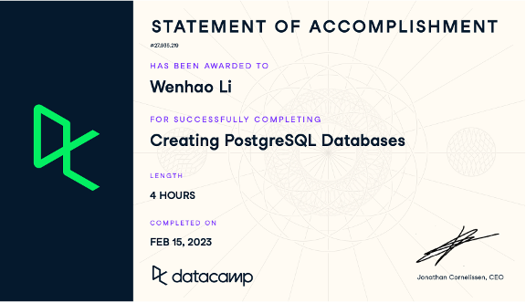

# Wenhao-CIDM6395-Capstone

Assessing Data Analytics

What Do I Know (Strengths):
Data Analysis Techniques:
I am proficient in statistical analysis and data visualization, enabling me to extract meaningful insights from data. I have a strong grasp of data analysis techniques and have applied them in various projects.

Tool Proficiency:
I am skilled in using a range of data analytics tools, including Python, R, and data analytics platforms. These tools have been instrumental in my data analysis work and have allowed me to approach complex data challenges effectively.

Statistical Knowledge:
I have demonstrated capabilities in performing hypothesis testing, regression analysis, and clustering. These statistical techniques are among my strengths, and I have utilized them successfully in different projects.

Where Am I Weak (Weaknesses):
Big Data Analytics:
One area where I recognize a gap in my knowledge is big data analytics. While I have a solid foundation in traditional data analytics, I have limited experience in handling and analyzing large-scale datasets, which is becoming increasingly important in today's data-driven world.

Advanced Machine Learning:
I acknowledge the need to improve my understanding of advanced machine learning algorithms. Areas such as deep learning and reinforcement learning are essential for solving complex problems, and I'm eager to enhance my skills in these domains.

Domain-Specific Knowledge:
To become a more well-rounded data analyst, I could work on enhancing my domain-specific knowledge. Gaining expertise in specific industries or sectors will allow me to provide more tailored solutions in real-world data analytics scenarios.

What Do I Wish I Knew:
Deep Learning Techniques:
I wish I had a deeper understanding of deep learning techniques, including neural networks and natural language processing. These advanced methods are crucial in areas like image recognition, natural language understanding, and more.

Real-Time Data Analytics:
Exploring real-time data analytics further is an area of interest. Understanding how to process and analyze data in real-time settings can be valuable in various applications, from finance to IoT.

Industry-Specific Challenges:
More hands-on experience with industry-specific data analytics challenges is something I desire. This would involve delving into the unique data-related issues faced by specific sectors, such as healthcare, finance, or e-commerce.

Support:
Samples of work:
https://github.com/wli1992/The-Pandas-Workshop; 

Source of knowledge:
VS code, Github, Textbook: The Pandas Workshop: A comprehensive guide to using Python for data analysis with real-world case studies. Excel, SQL Tutorial, Tableau, RapidMiner, Datacamp, Textbook: Data Science for Business.

Summary Statement:
In summary, my competencies in Data Analytics encompass statistical analysis, data visualization, tool proficiency, and statistical knowledge. I have successfully applied these skills in both academic and practical projects. I am enthusiastic about addressing my identified weaknesses and exploring areas I wish to know more about.

