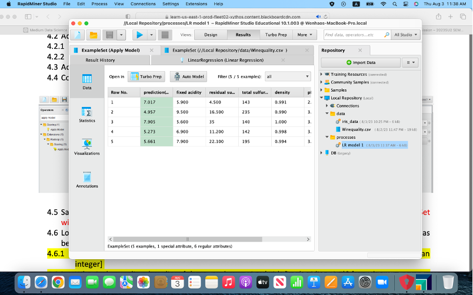
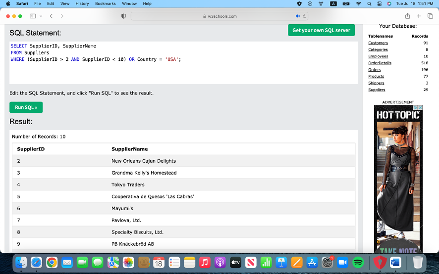
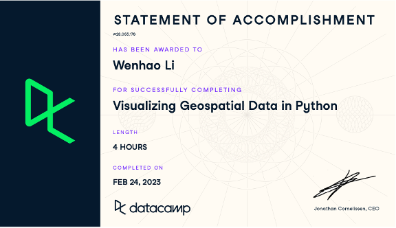

# Wenhao-CIDM6395-Capstone

Assessing Data Analytics

What Do I Know (Strengths):
Data Analysis Techniques:
I am proficient in statistical analysis and data visualization, enabling me to extract meaningful insights from data. I have a strong grasp of data analysis techniques and have applied them in various projects.

Tool Proficiency:
I am skilled in using a range of data analytics tools, including Python, R, and data analytics platforms. These tools have been instrumental in my data analysis work and have allowed me to approach complex data challenges effectively.

Statistical Knowledge:
I have demonstrated capabilities in performing hypothesis testing, regression analysis, and clustering. These statistical techniques are among my strengths, and I have utilized them successfully in different projects.

Where Am I Weak (Weaknesses):
Big Data Analytics:
One area where I recognize a gap in my knowledge is big data analytics. While I have a solid foundation in traditional data analytics, I have limited experience in handling and analyzing large-scale datasets, which is becoming increasingly important in today's data-driven world.

Advanced Machine Learning:
I acknowledge the need to improve my understanding of advanced machine learning algorithms. Areas such as deep learning and reinforcement learning are essential for solving complex problems, and I'm eager to enhance my skills in these domains.

Domain-Specific Knowledge:
To become a more well-rounded data analyst, I could work on enhancing my domain-specific knowledge. Gaining expertise in specific industries or sectors will allow me to provide more tailored solutions in real-world data analytics scenarios.

What Do I Wish I Knew:
Deep Learning Techniques:
I wish I had a deeper understanding of deep learning techniques, including neural networks and natural language processing. These advanced methods are crucial in areas like image recognition, natural language understanding, and more.

Real-Time Data Analytics:
Exploring real-time data analytics further is an area of interest. Understanding how to process and analyze data in real-time settings can be valuable in various applications, from finance to IoT.

Industry-Specific Challenges:
More hands-on experience with industry-specific data analytics challenges is something I desire. This would involve delving into the unique data-related issues faced by specific sectors, such as healthcare, finance, or e-commerce.

Support:
Samples of work:
https://github.com/wli1992/The-Pandas-Workshop; 

Source of knowledge:
VS code, Github, Textbook: The Pandas Workshop: A comprehensive guide to using Python for data analysis with real-world case studies. Excel, SQL Tutorial, Tableau, RapidMiner, Datacamp, Textbook: Data Science for Business.

Summary Statement:
In summary, my competencies in Data Analytics encompass statistical analysis, data visualization, tool proficiency, and statistical knowledge. I have successfully applied these skills in both academic and practical projects. I am enthusiastic about addressing my identified weaknesses and exploring areas I wish to know more about.

Assessing Data Management

What I Know (Strengths):

Data Modeling: I have a strong understanding of data modeling techniques and have worked with various tools to design efficient and structured databases. I can create Entity-Relationship Diagrams (ERDs) and understand the importance of normalization in database design.

SQL: I am proficient in SQL (Structured Query Language) and can write complex queries to retrieve, manipulate, and manage data in relational databases. I'm confident in using SQL for data retrieval and data modification tasks.

Database Management Systems: I have hands-on experience with different Database Management Systems (DBMS) like MySQL, PostgreSQL, and SQLite. I can set up and manage databases, as well as optimize their performance.

Data Warehousing: I have a basic understanding of data warehousing concepts, including ETL (Extract, Transform, and Load) processes, data warehouses, and data marts.

Data Quality: I understand the importance of data quality and have used data profiling and cleansing techniques to ensure data accuracy.

Where I'm Weak (Weaknesses):

NoSQL Databases: I have limited experience with NoSQL databases like MongoDB, Cassandra, or Redis. I need to strengthen my knowledge in this area, as NoSQL databases are becoming increasingly popular for handling unstructured data.

Big Data Technologies: I lack expertise in big data technologies like Hadoop, Spark, and distributed data processing. In the era of big data, it's crucial to have skills in handling large datasets and leveraging these technologies for data analysis.

Advanced Data Analytics: While I have a solid foundation in data analytics, I'm less proficient in advanced data analysis techniques, machine learning, and predictive modeling. I wish to enhance my skills in these areas to work on more complex analytics projects.

Data Security: My knowledge of data security and privacy is basic. I need to delve deeper into data encryption, access control, and compliance with data protection regulations.

What I Wish I Knew:

Advanced Machine Learning: I wish I had a deeper understanding of advanced machine learning algorithms, neural networks, and deep learning. These are powerful tools for predictive analytics and AI applications.

Data Governance: I'd like to explore data governance practices and strategies to ensure data quality, compliance, and responsible data management within organizations.

Real-time Data Processing: More hands-on experience with real-time data processing and stream processing frameworks like Apache Kafka would be valuable in today's fast-paced data environments.

Data Ethics and Privacy: In an era of increasing data privacy concerns, I wish to have a comprehensive grasp of data ethics and privacy regulations like GDPR.

Source of knowledge: Python, Google Colab, exercises from textbook: Data management: Databases and Organizations, Datacamp

Summary Statement:

In summary, I have a strong foundation in Data Management, including data modeling, SQL, and database management. However, I recognize the need to strengthen my knowledge in areas such as NoSQL databases, big data technologies, advanced data analytics, and data security. I'm eager to continue learning and integrating these skills into my portfolio and capstone project, where effective Data Management will be essential for success.

Support: Samples of work
   

